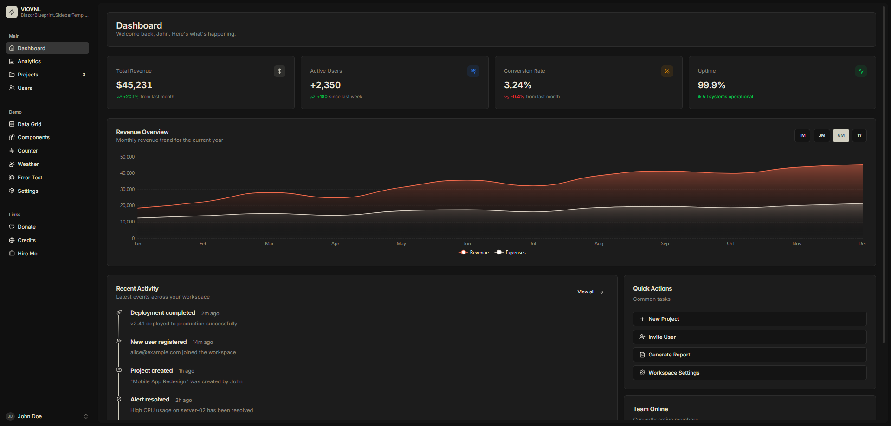
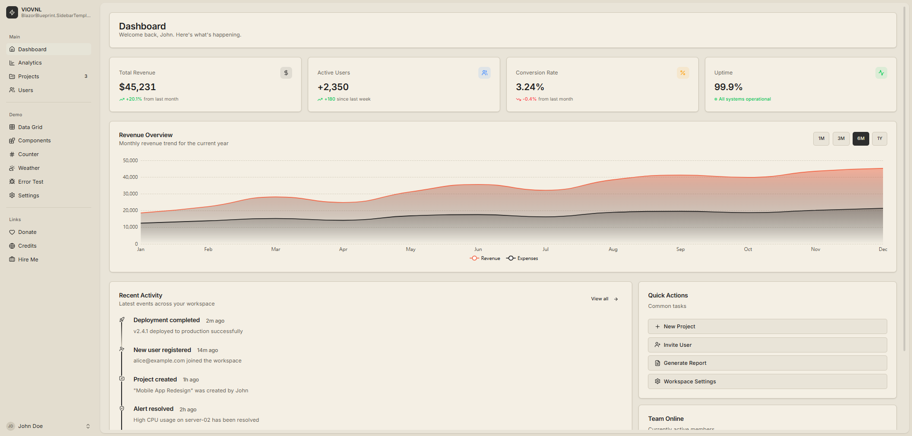
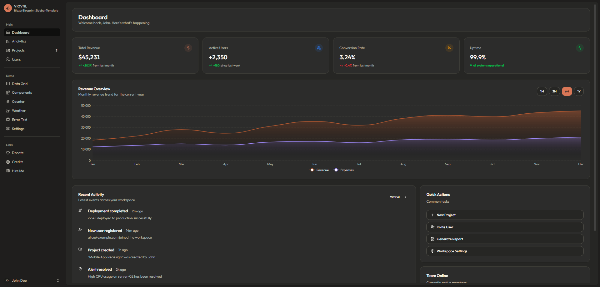
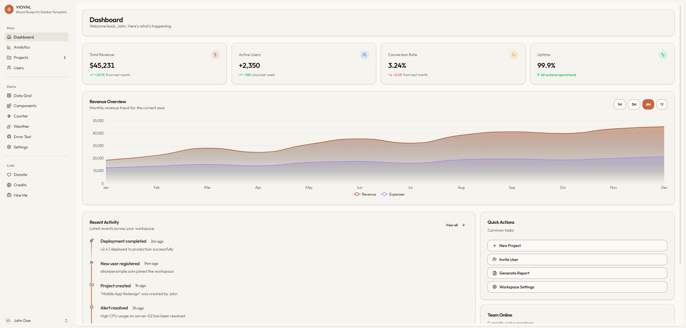
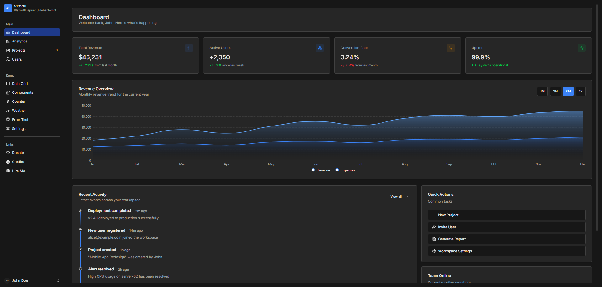
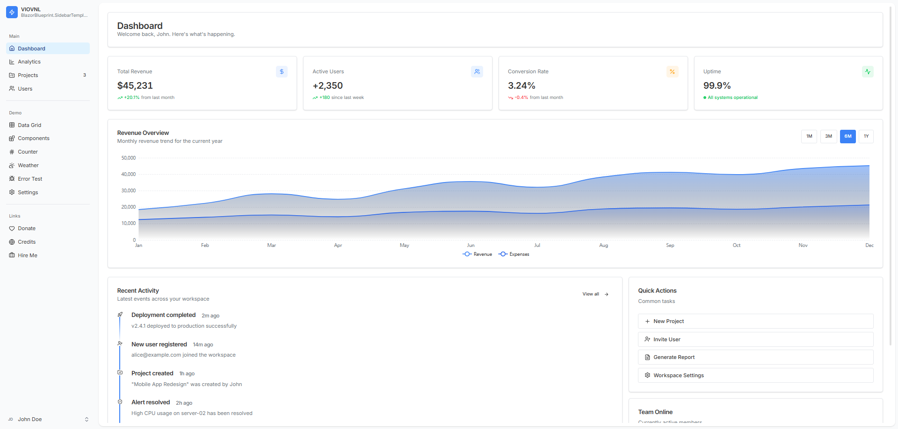
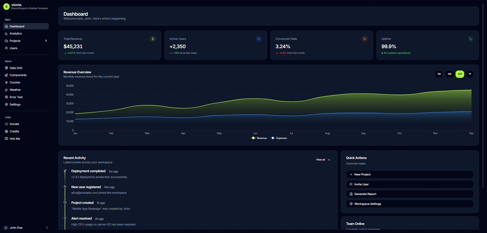
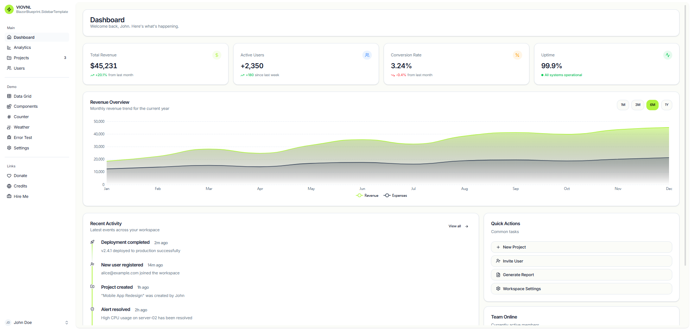
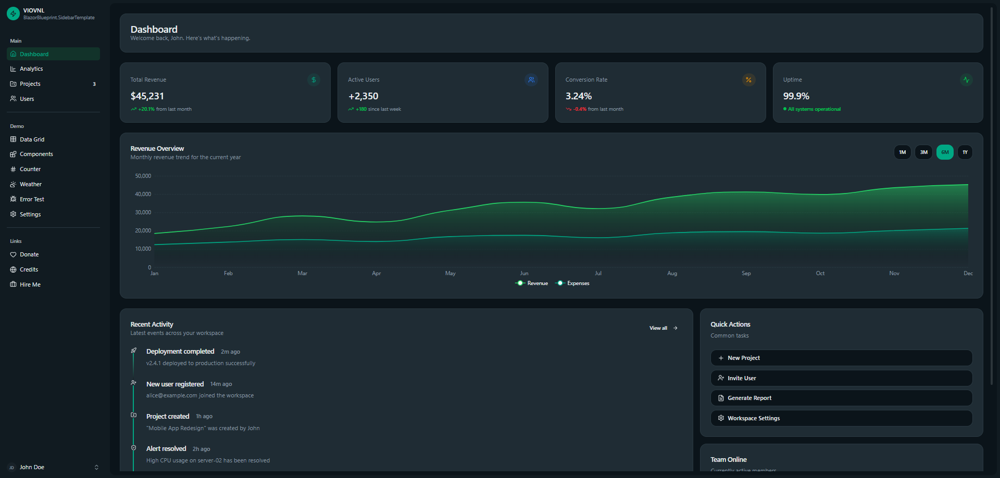
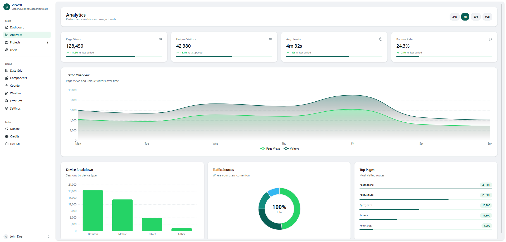

# BlazorBlueprint Sidebar Template

A production-ready Blazor Server application template with a polished collapsible sidebar layout, built with [BlazorBlueprint](https://blazorblueprintui.com/) components and Tailwind CSS v4.

> Built by **VIOVNL** — [viov.nl](https://viov.nl) | [Hire me](https://viov.nl/#contact) | [Sponsor](https://github.com/sponsors/VIOVNL)

---

## Screenshots

### Default — Dark

<p align="center">
  
</p>

### Default — Light

<p align="center">
  
</p>

### Claude — Dark

<p align="center">
  
</p>

### Claude — Light

<p align="center">
  
</p>

### Modern Minimal — Dark

<p align="center">
  
</p>

### Modern Minimal — Light

<p align="center">
  
</p>

### Light Green — Dark

<p align="center">
  
</p>

### Light Green — Light

<p align="center">
  
</p>

### WhatsApp — Dark

<p align="center">
  
</p>

### WhatsApp — Light

<p align="center">
  
</p>
---

## Features

- **Collapsible sidebar** with grouped navigation sections and badge indicators
- **Dark mode** with multiple theme presets (Default, Claude, Modern Minimal, Light Green, WhatsApp)
- **10 pre-built pages** — Dashboard, Analytics, Projects, Users, Components, Counter, Weather, Settings, and more
- **Custom reconnect modal** with styled retry/resume handling
- **Responsive layout** powered by Tailwind CSS v4
- **Lucide icons** throughout via BlazorBlueprint.Icons.Lucide

## Tech Stack

| Layer | Technology |
|-------|-----------|
| Framework | Blazor Server (.NET 10) |
| UI Components | [BlazorBlueprint](https://blazorblueprintui.com/) |
| Styling | Tailwind CSS v4 |
| Icons | Lucide (via BlazorBlueprint.Icons.Lucide) |
| Tooltips & Dropdowns | Floating UI |

## Getting Started

### Prerequisites

- [.NET 10 SDK](https://dotnet.microsoft.com/download/dotnet/10.0)
- [Node.js](https://nodejs.org/) (for Tailwind CSS CLI)

### Run

```bash
npm install
dotnet run
```

The app will be available at `https://localhost:5001` (or the port configured in `Properties/launchSettings.json`).

## Project Structure

```
Components/
  Layout/
    MainLayout.razor        # Sidebar + top bar layout
    ReconnectModal.razor     # Custom reconnect UI
  Pages/
    Home.razor               # Dashboard with cards, chart, timeline
    Analytics.razor          # Traffic & performance metrics
    Projects.razor           # Project management with tabs
    Users.razor              # Team member data table
    Components.razor         # Component showcase
    Settings.razor           # Theme & notification settings
    Counter.razor            # Interactive counter demo
    Weather.razor            # Weather forecast table
Services/
  ThemeService.cs            # Server-side theme management
wwwroot/
  css/
    app-input.css            # Tailwind source file
    app.css                  # Compiled Tailwind output
    themes/                  # Swappable theme stylesheets
  js/
    theme.js                 # Client-side theme switching
```

## Theming

The template ships with a full theming system that supports live theme switching and dark mode — no page reload required.

### How it works

Each theme is a standalone CSS file in `wwwroot/css/themes/` that defines CSS custom properties in OKLCH color space. These variables are mapped to Tailwind theme tokens in `app-input.css` via `@theme inline`, so standard Tailwind utilities like `bg-primary` or `text-muted-foreground` automatically resolve to the active theme's colors.

```
app-input.css                     Theme file (e.g. default.css)
┌──────────────────────┐          ┌──────────────────────────┐
│ @import tailwindcss   │          │ :root {                  │
│ @import default.css   │◄─────────│   --primary: oklch(...)  │
│                       │          │   --background: oklch(…) │
│ @theme inline {       │          │   --font-sans: "Inter"   │
│   --color-primary:    │          │ }                        │
│     var(--primary)    │          │ .dark {                  │
│   ...                 │          │   --primary: oklch(...)  │
│ }                     │          │   ...                    │
└──────────────────────┘          └──────────────────────────┘
```

### Theme switching flow

1. **No flash on load** — An inline `<script>` in `App.razor` reads `localStorage` and injects the theme `<link>` + `.dark` class before the first paint.
2. **Live switching** — `ThemeService.cs` calls into `theme.js` via JS interop to swap the `<link>` stylesheet `href` and toggle the `.dark` class on `<html>`.
3. **Font loading** — Each theme specifies its own font families (`--font-sans`, `--font-serif`, `--font-mono`). `theme.js` parses the theme CSS, extracts the font names, and loads them from Google Fonts dynamically. This can be toggled off in Settings for offline use.
4. **Persistence** — Theme choice, dark mode, and font loading preference are stored in `localStorage`.

### Included themes

| Theme | Fonts | Style |
|-------|-------|-------|
| Default | Inter, Playfair Display, JetBrains Mono | Professional, high contrast |
| Claude | Outfit, Geist Mono | Soft, warm tones |
| Modern Minimal | Inter, Georgia, JetBrains Mono | Tight radius, purple/indigo accents |
| Light Green | Inter, Georgia, JetBrains Mono | Nature-inspired greens |
| WhatsApp | Segoe UI, Georgia, SFMono | Green communication style |

### Adding a new theme

1. Copy `wwwroot/css/themes/default.css` to `mytheme.css`
2. Edit the `:root` (light) and `.dark` color values
3. Register it in `Services/ThemeService.cs`:
   ```csharp
   new("My Theme", "mytheme.css")
   ```
4. It will appear in the Settings page automatically.

## Tailwind CSS Setup

Tailwind v4 is compiled at build time via an MSBuild target in the `.csproj`:

```xml
<Target Name="BuildTailwindCSS" BeforeTargets="BeforeBuild">
  <Exec Command="npx @tailwindcss/cli -i wwwroot/css/app-input.css -o wwwroot/css/app.css" />
</Target>
```

- **Source:** `wwwroot/css/app-input.css` — imports Tailwind, the default theme, and defines the `@theme inline` block that bridges CSS variables to Tailwind tokens.
- **Output:** `wwwroot/css/app.css` — the compiled stylesheet loaded by the app.
- **Dark mode:** Uses a custom variant `@custom-variant dark (&:where(.dark, .dark *))` so the `.dark` class on `<html>` activates all `dark:` utilities.
- **Content scanning:** `@source "../../Components"` tells Tailwind to scan all Razor components for class usage.

## About BlazorBlueprint

[BlazorBlueprint](https://blazorblueprintui.com/) is a Blazor component library focused on clean design and developer experience. This template demonstrates how to build a full application layout using BlazorBlueprint primitives and components.

## About VIOVNL

This template is built and maintained by **VIOVNL**.

- **Website:** [viov.nl](https://viov.nl)
- **Hire me:** [viov.nl/#contact](https://viov.nl/#contact)
- **Sponsor:** [github.com/sponsors/VIOVNL](https://github.com/sponsors/VIOVNL)

## License

MIT
